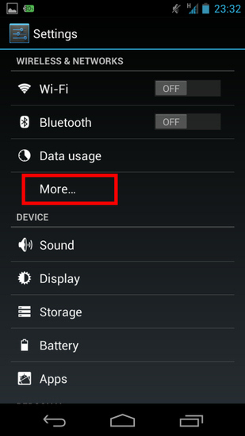
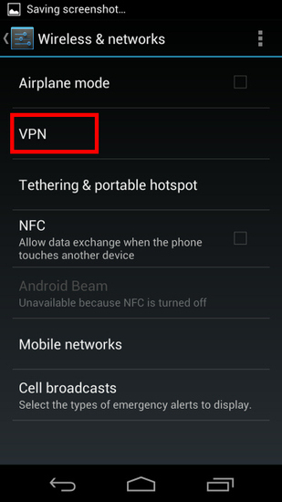
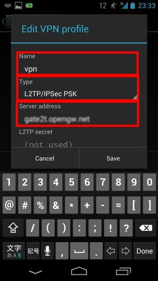
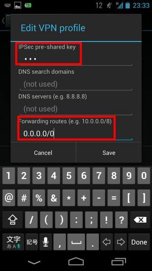
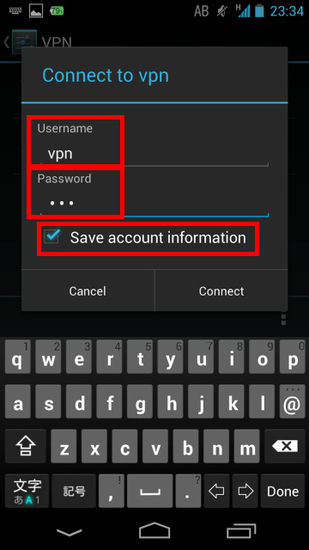

# Android客户端连接配置

#### 1.追加vpn配置 {#1追加vpn配置}

 点击`Settings`（设置）.

在`Wireless & Networks`\(WIFI\)目录,

点击 `More...`\(更多\) ,然后选择 `VPN`.

 点击`Add VPN profile`（追加vpn）来创建vpn连接设置.

 编辑`vpn`配置文件

 选择`Show advanced options`\(显示更多\),可以打开更多选项

 在配置里面，填入如下信息：


 `Name`\(名字\)：



 `Type`\(类型\): **`L2TP/IPSec PSK`**



 `Server address`\(服务器\)：



 `IPSec pre-shared key`\(预共享密钥\)：**vpn**



 `Forwarding routes`\(路由转发\):**0.0.0.0/0**



 `Username`\(账号\)：



 `Password`\(密码\)：


> 以上信息在申请账号时，会发送邮件到您的邮箱.

#### 2.连接vpn {#2连接vpn}

选择刚才创建的vpn配置,然后就可以连接vpn使用了.

查看连接状态,确认连接是否成功.

