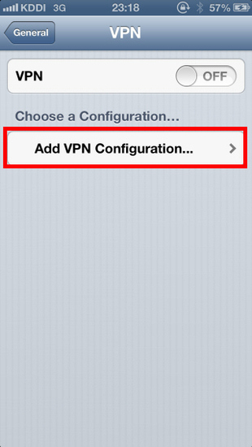

# ios客户端连接配置

#### 1.追加vpn配置 {#1追加vpn配置}

点击`Settings`（设置）

在 `General`（一般） 里面打开 `VPN`,

点击 `Add VPN Configuration...`（追加vpn）

 选择`L2TP`，填入配置信息

 在配置里面，填入如下信息：


Server\(服务器\)：



 `Account`\(账号\)：



 `Password`\(密码\)：



 `Secret`\(预共享密钥\)： **vpn**



 `Send All Traffic`\(发送所有流量\)：**`ON`**_\(打开\)_


> 以上信息在申请账号时，会发送邮件到您的邮箱.

#### 2.连接vpn {#2连接vpn}

选择刚才创建的vpn配置,然后就可以连接vpn使用了.

查看`Status`\(连接状态\),确认连接是否成功.

