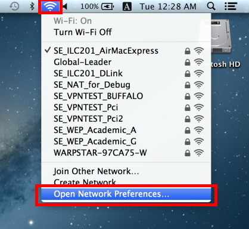
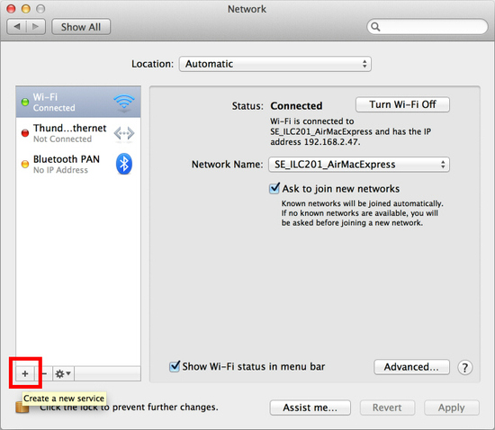
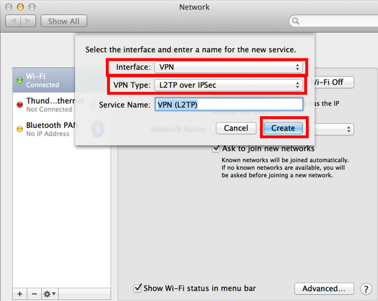
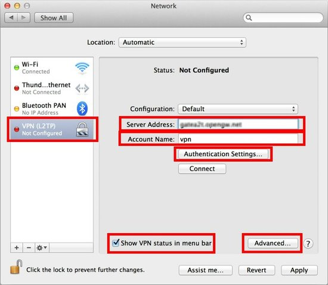
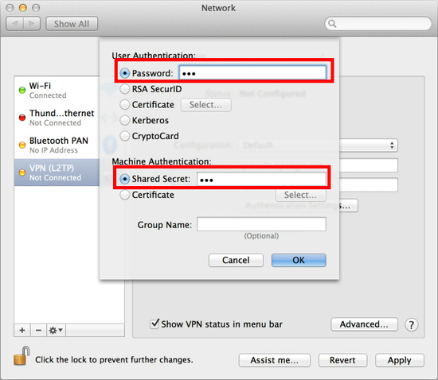
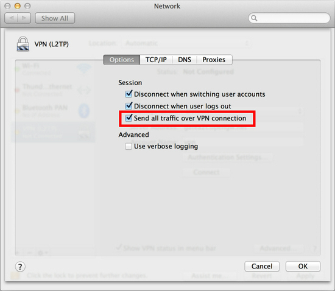

# Mac客户端连接配置

#### 1.追加vpn配置 {#1追加vpn配置}

追加网络配置

 点击`+`

选择

`Interface:VPN`

`VPN Type`:`L2TP over IPsec`

点击`Create`\(创建\).

 填入如下信息


 `Server Address`\(服务器\):



 `Account Name`\(账号\):


> 以上信息在申请账号时,会发送邮件到您的邮箱.

点击`Authentication Settings...`,

填入如下信息.


 `Password`\(密码\):



 `Shared Secret`\(预共享密钥\):**vpn**


> 以上信息在申请账号时,会发送邮件到您的邮箱.

点击`OK`\(确认\)保存认证信息后，

会自动返回到`Network`.+

点击`Advanced...` \(显示更多\)后,

选择`Send all traffic over VPN connection`\(发送所有流量\).

#### 2.连接vpn {#2连接vpn}

选择刚才创建的vpn配置,然后就可以连接vpn使用了.+

查看连接状态,确认连接是否成功.

