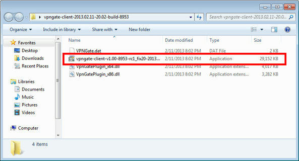
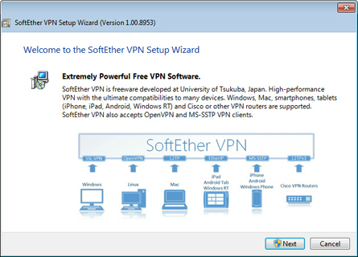
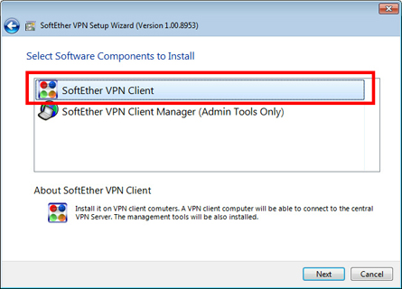
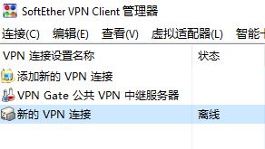
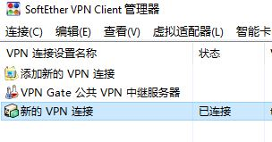

# Windows客户端连接配置

使用专用的Windows客户端连接vpn服务器。

客户端软件和配置文件，我会通过邮件发送到您的邮箱。

#### 1.软件安装 {#1软件安装}

双击安装文件

 点击`Next`

 选择`SoftEther VPN Client`,安装完成.

打开软件,选择`连接`,点击`导入VPN连接设置`

选择配置文件\(`sample.vpn`\)

 会自动创建`新的VPN连接`,这个时候的状态是`离线`

#### 2.连接vpn {#2连接vpn}

双击`新的VPN连接`,连接vpn服务器.

查看连接状态,确认连接是否成功.

这个时候的状态是`已连接`.

